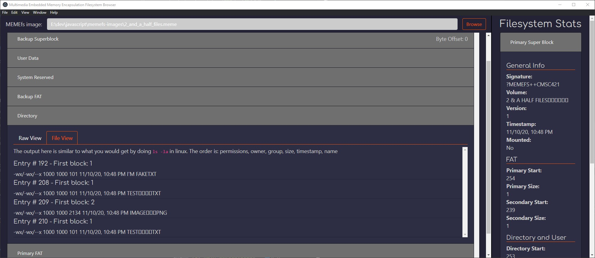
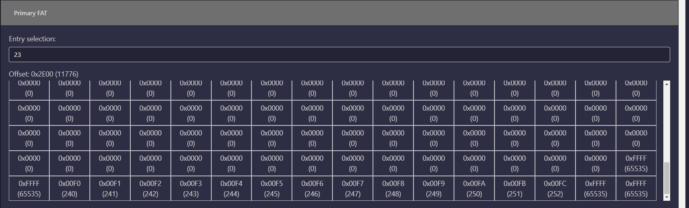
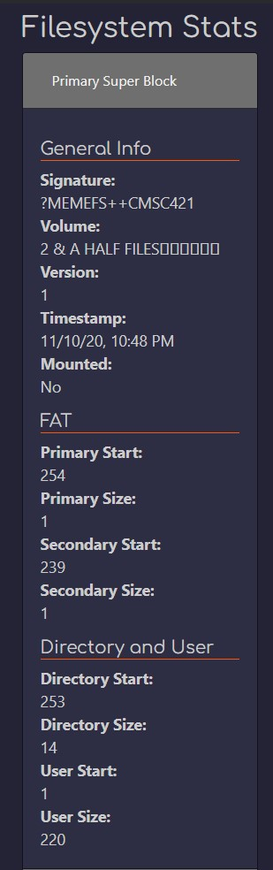

One of the assignments for the Fall 2018 and 2020 semesters was to implement a
[FUSE](https://en.wikipedia.org/wiki/Filesystem_in_Userspace) module to allow
mounting [VMU](https://en.wikipedia.org/wiki/VMU) images on
Linux. In order to aid students while developing their modules I made this tool
that will read the image and allow inspection of various aspects. These aspects
are focused towards developing the filesystem module, so for example it will
show you the raw bytes of a file entry but will not attempt to read the contents
of said file. We actually used this project twice with variations. The first
time it was with a true VMU image, while the second time we made MEMEfs which
was an extended version of VMUFS.

The images here are from the latest version of MEMEfs Viewer. Unfortunately I
cannot share any code here or too many details as variations of the project will
be given again. And plagiarism is not good.

Showing the expected results of `ls -la`

Viewing the raw bytes of the primary FAT.

Details of the primary superblock.
