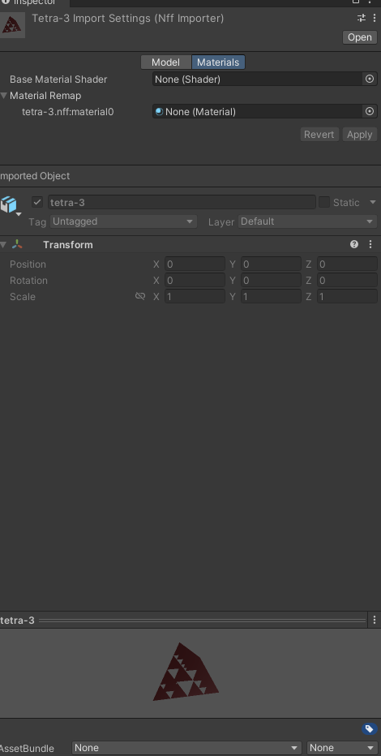
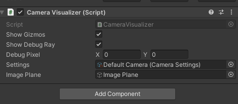

When discussing raytracing in class I often find students that need to visualize
what is happening in order to understand the math behind it. And I totally
understand them because I work the exact same way. That's why I created this
project so both I and the students can have something tangible to interact with
when I am trying to explain how to set up an image plane for example.

The project allows the user to change various parameters such as focal length,
camera position, image resolution, etc and see in real time how that affects the
setup. There are a few other things in there that have to do with explaining
concepts specific to the projects the students will be doing. Bellow I have some
high-lights and interesting about the project that others might want to
integrate in their own projects.

## NFFImporter

The class projects use the [NFF
format](http://paulbourke.net/dataformats/nff/nff1.html) for their raytracing
scenes. NFF is a simple text based format that doesn't have to deal with mesh
indexing like OBJ for example. Therefore it is very suitable for teaching as
students do not have to hassle with parsing it too much and can focus on
raytracing.

However, Unity does not support nff files so I made my own importer seen bellow.

The importer settings as seen in Unity

To achieve this we need to create two classes, one of them inheriting from
`ScriptedImporter`
([docs](https://docs.unity3d.com/Manual/ScriptedImporters.html)) and one
inheriting from `ScriptedImporterEditor`
([docs](https://docs.unity3d.com/2020.1/Documentation/ScriptReference/Experimental.AssetImporters.ScriptedImporterEditor.html)).
The reason we need an editor is to provide any custom interface we want our
importer to have. If you notice the image above, there is the capability to
override "materials" in the nff file, with custom ones. That does not come out of
the box. For more information I will direct you to
[NffImporter.cs](https://github.com/iboutsikas/raytracing-viz/blob/63f7ff82430b5b267613c31ca4cc1284e6d0f627/Assets/Scripts/CustomImporters/Editor/Nff/NffImporter.cs)
and
[NffImporterEditor.cs](https://github.com/iboutsikas/raytracing-viz/blob/63f7ff82430b5b267613c31ca4cc1284e6d0f627/Assets/Scripts/CustomImporters/Editor/Nff/NffImporterEditor.cs).

## Camera Rig

The camera rig inspector.

This is one of the elements the user can directly interact with. It modifies the
gizmos shown in the very first image of this page. You can find the code in
[Camera
Visualizer](https://github.com/iboutsikas/raytracing-viz/blob/63f7ff82430b5b267613c31ca4cc1284e6d0f627/Assets/Scripts/CameraVisualizer.cs).

## Camera Settings

This is a simple scriptable object that directly matches the "camera
description" found in an nff file. It is the second element users can interact
with to change how the camera rig looks like and help explain the math behind
setting up a camera for raytracing. You can find the code at
[CameraSettings.cs](https://github.com/iboutsikas/raytracing-viz/blob/63f7ff82430b5b267613c31ca4cc1284e6d0f627/Assets/Scripts/CustomImporters/CameraSettings.cs).
